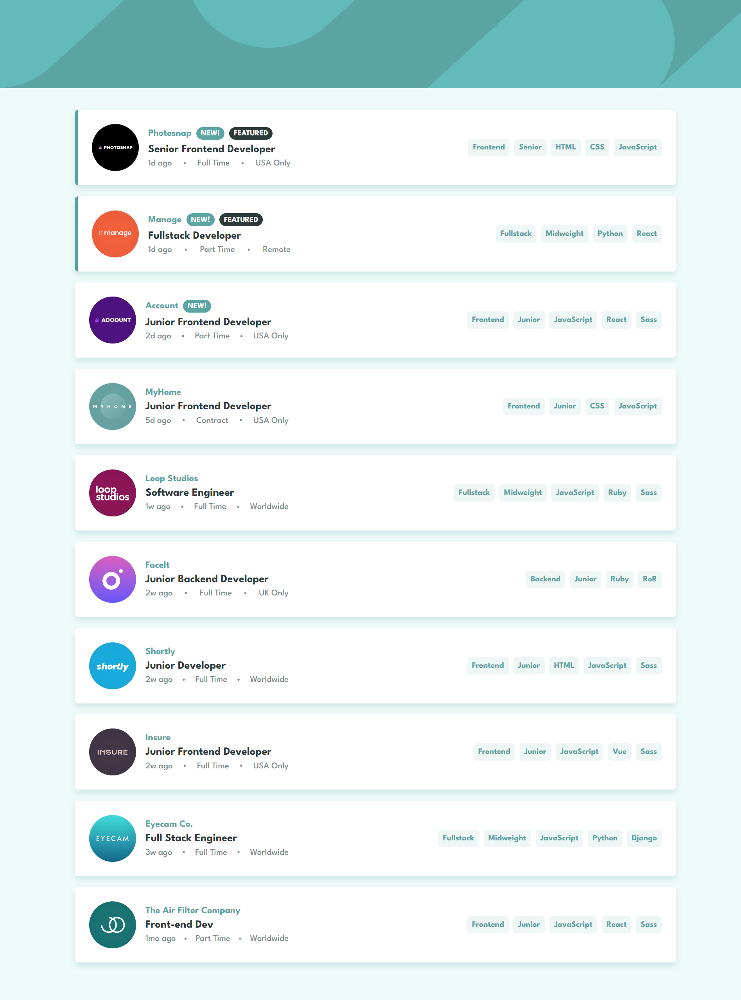

## Frontend Mentor - Job listings with filtering

- This is a solution to the [Job listings with filtering challenge on Frontend Mentor](https://www.frontendmentor.io/challenges/job-listings-with-filtering-ivstIPCt).
- This is a simple filterable job listing website made with plain JavaScript, HTML, and CSS.
- Listings are created by fetching the data from an in-built JSON file, and each listing contains some predefined filter tags that users can select and apply.
- This project has been created to showcase my core programming (language) skills.

## Table of contents

- [Overview](#overview)
  - [The challenge](#the-challenge)
  - [Screenshot](#screenshot)
  - [Links](#links)
- [Built with](#built-with)
- [Author](#author)

## Overview

### The challenge

Users should be able to:

- View the optimal layout for the site depending on their device's screen size
- See hover states for all interactive elements on the page
- Filter job listings based on the categories

### Screenshot

#### Desktop

#### Mobile

### Links

- Live Site URL: [JobListings](https://joblistings-sigma.vercel.app/)

## Built with
- Javasript
- HTML
- CSS 

## Author

- Name - Pratik Bhangire [pratikbhangire@gmail.com](pratikbhangire@gmail.com)
- Frontend Mentor - [@pratikbhangire123](https://www.frontendmentor.io/profile/pratikbhangire123)
- LinkedIn - [@pratik-bhangire](https://www.linkedin.com/in/pratik-bhangire/)